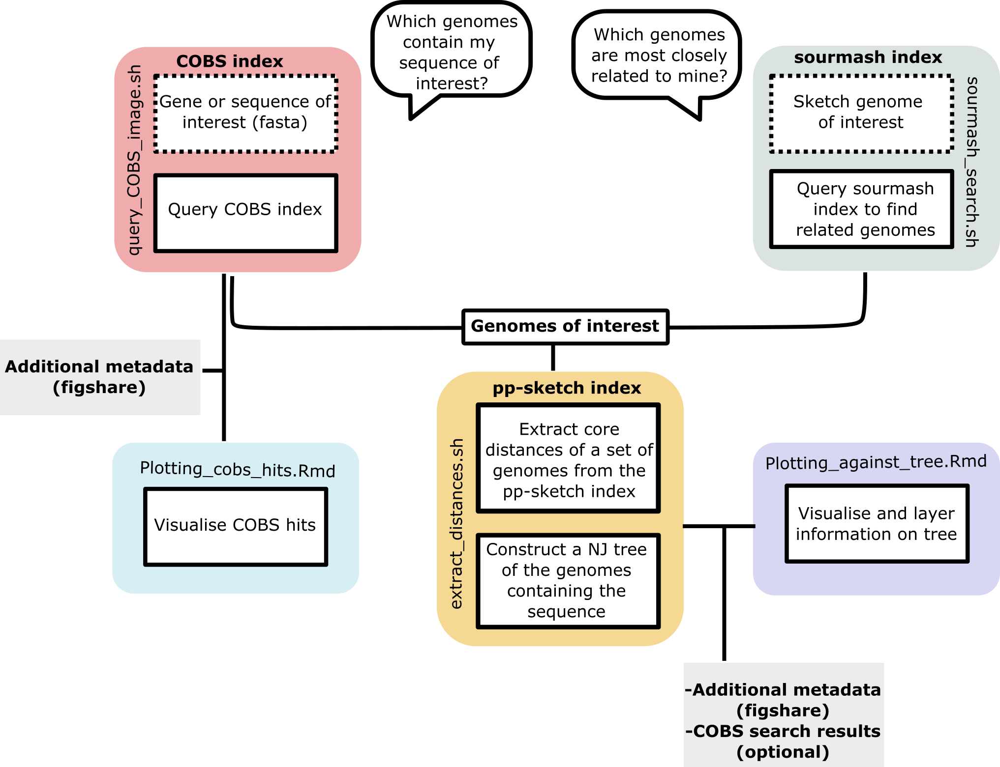

# 661K_query_indexes

661K_query_indexes contains a number of bash, python and R notebooks to utilise the databases associated with the 661K manucript https://doi.org/10.1371/journal.pbio.3001421

## Requirements
* Singularity or Docker to use `Docker://leandroishilima/661k_query_indexes:0.0.1`

* Assemblies and Indexes can be found on the [ftp](http://ftp.ebi.ac.uk/pub/databases/ENA2018-bacteria-661k/)

* QC, characterisation and ENA metadata for the assemblies are on [figshare](https://doi.org/10.6084/m9.figshare.16437939.v1)

* R 

## Usage

### Query COBS index - DNA search via a kmer based approach
Note: update path for `cobs_to_table.py` in `query_COBS_image.sh` 
```bash
query_COBS_image.sh <query.fasta> <threshold> #query.fasta can be a multifasta
```
The `_results_table.txt` file provides the results of the search. 

### Sketch and query a genome against the sourmash index
```bash
sourmash_search.sh <input.fasta> <prefix_for_outfiles> #input can be fastq files as well
```
The `_genome_similarity.txt` file provides the results of the similarity search and `_related_sample_ids.txt` is just the sample_ids and can be used as the subset input for pp_sketch. 

### Extract core and accessory distances of a subset of genomes using the pp_sketch index
This script extracts the core distances between genomes and used these to generate a NJ tree. The script for producing the tree (`ppsketch_tree.py`), which is called by `extract_distances.sh`, is adapted from John Lees. 
Note: update path for `generate_tree` in `extract_distances.sh` 
Currently this needs to be performed in the same directory as where the pp-sketch index is held. 

```bash
extract_distances.sh <list_of_sample_ids_to_subset> 
```
The distance tree is `out/outtree`. 

### R notebooks for general plotting
These have been designed for use on local computer and requires the paths of input files to be updated
* Plotting_cobs_hits.Rmd
* Plotting_against_tree.Rmd

### Basic workflow schematic



## References
1. Bingmann T, Bradley P, Gauger F, Iqbal Z. COBS: a Compact Bit-Sliced Signature Index. arXiv:190509624. 2019. Available: http://arxiv.org/abs/1905.09624

2. Pierce NT, Irber L, Reiter T, Brooks P, Brown CT. Large-scale sequence comparisons with sourmash. F1000Res. 2019;8: 1006. doi:10.12688/f1000research.19675.1

3. Lees JA, Harris SR, Tonkin-Hill G, Gladstone RA, Lo SW, Weiser JN, et al. Fast and flexible bacterial genomic epidemiology with PopPUNK. Genome Res. 2019;29: 304–316. doi:10.1101/gr.241455.118

